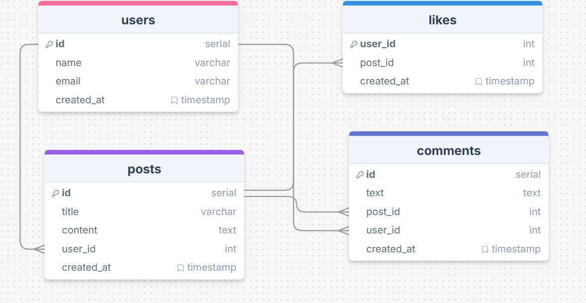

# 2-oy imtixon

## 📝 Blog Platform API
---

## 🎯 Maqsad

Quyidagilarni mavzularni ishlatish kerak:

* Express.js yordamida API yozish +
* PostgreSQL bilan ishlash +
* Tablelar orasida bog‘lanish qilish +
* CRUD amallarini bajarish +
* Filter, search, sort va pagination ishlatish +

---

### men bitta like amalini qilaolmadim yani post qismini lekin boshqa amallarim ishlayapti

## ishga tuwiriw

---
npm  run dev      --manawu kamanda bilan shlaydi 

---

## manawu korinishda post joylanadi

---
{
name:"sobir",
email:"mamamm@.com "

}

## yaratgan schemam  manawu loyiha uchun 

---

##
##
## men  routes va yana boshqalar o'tilganda kelmagan edim oshani uchun qilganim yoq 
